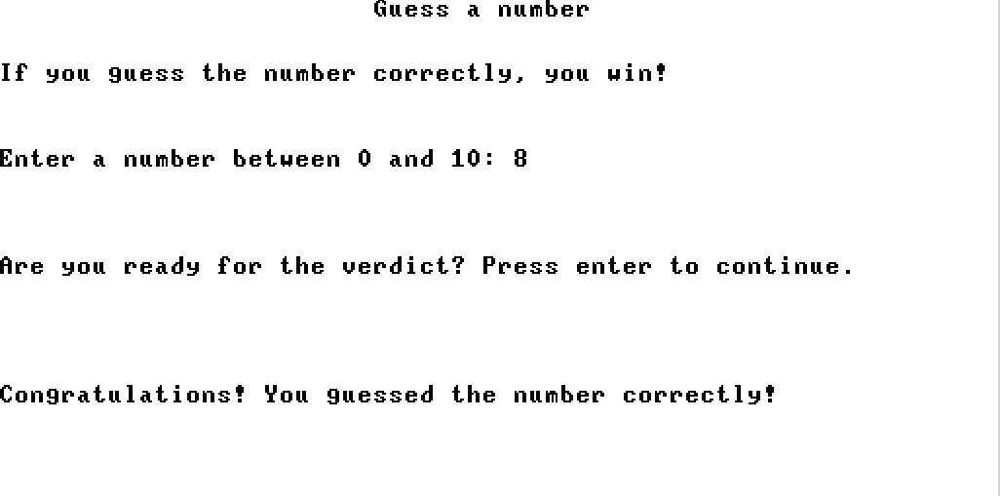
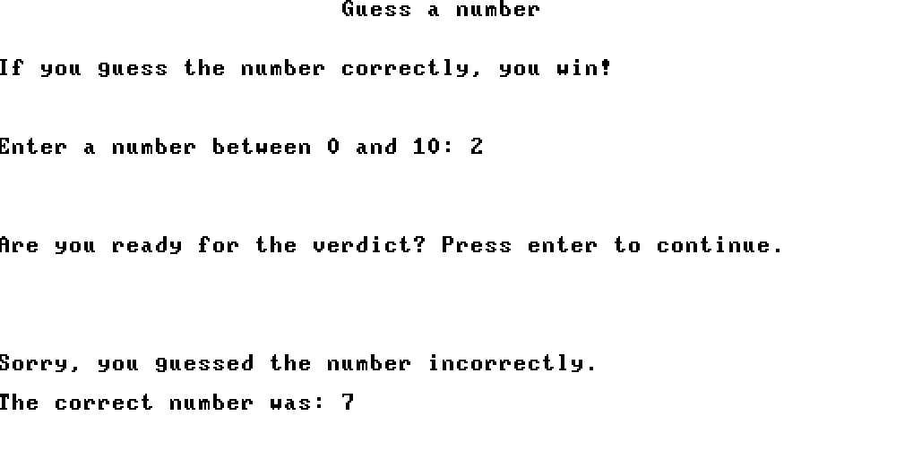

# Programs

This folder contains programs written for Vulcan-16, including games.

## Projects

### **Project 9: GuessANumber Game**
- **Purpose**: Implement a simple number-guessing game in Jack.
- **Components**:
  - `Main.jack`: Main game logic.
  - `Random.jack`: Random number generator.
#### Screenshots

